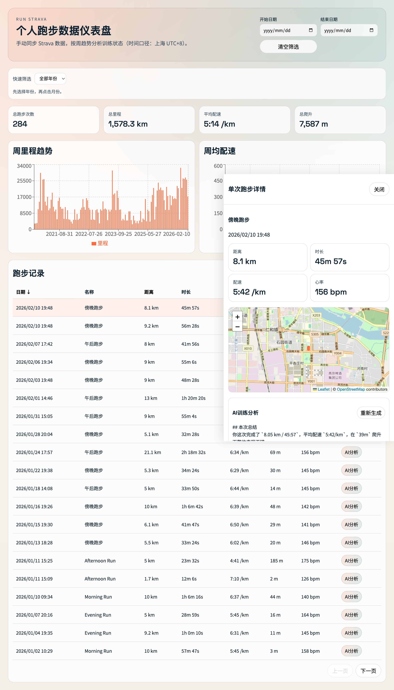

# Run Strava

本地 Strava 跑步数据仪表盘。支持手动同步数据到 SQLite，并提供可视化分析与 AI 跑步解读。

## Preview



## Features

- 手动 CLI 同步 Strava 跑步活动（仅 `Run`）
- 总览 KPI：总跑步次数、总里程、平均配速、总爬升
- 周趋势图：周里程、周均配速
- 跑步记录表：分页、排序、日期筛选
- 年/月快速筛选：例如 `2026年 -> 1月/2月/3月`
- 单次详情：路线地图、分段配速
- AI 分析：调用本机 Codex CLI 生成训练建议
- AI 分析持久化：每次生成写入 SQLite，重新生成覆盖上一次

## Tech Stack

- Frontend: React + Vite + TypeScript + Recharts + Leaflet
- Backend: Node.js + Express + TypeScript
- Database: SQLite (`better-sqlite3`)
- CLI: Commander + TypeScript
- Test: Vitest + Testing Library + Supertest

## Project Structure

```text
src/
  cli/        # Strava 同步命令与 API 客户端
  db/         # SQLite schema 与 repository
  server/     # Express API
  shared/     # 前后端共享类型
  web/        # React 页面
data/         # 本地数据库目录（默认 data/strava.db）
```

## Quick Start

### 1) 安装依赖

```bash
npm install
```

### 2) 配置环境变量

```bash
cp .env.example .env
```

`.env` 示例：

```env
STRAVA_ACCESS_TOKEN=your_strava_access_token
STRAVA_DB_PATH=data/strava.db
PORT=8787
```

### 3) 同步数据

全量：

```bash
npm run strava:sync -- --full
```

增量（从指定日期）：

```bash
npm run strava:sync -- --from 2023-01-01
```

### 4) 启动开发服务

```bash
npm run dev
```

- Web: [http://localhost:5173](http://localhost:5173)
- API: [http://localhost:8787](http://localhost:8787)

## Strava Token 获取

1. 打开授权链接（替换 `CLIENT_ID`）：

```text
https://www.strava.com/oauth/authorize?client_id=CLIENT_ID&redirect_uri=http%3A%2F%2Flocalhost%2Fexchange_token&response_type=code&approval_prompt=force&scope=read,activity:read_all
```

2. 授权后从回调 URL 中复制 `code`。
3. 用 `code` 换取 token：

```bash
curl -X POST https://www.strava.com/api/v3/oauth/token \
  -d client_id=YOUR_CLIENT_ID \
  -d client_secret=YOUR_CLIENT_SECRET \
  -d code=YOUR_CODE \
  -d grant_type=authorization_code
```

4. 将响应中的 `access_token` 写入 `.env` 的 `STRAVA_ACCESS_TOKEN`。

## Timezone

- 页面显示、日期筛选、周趋势分组统一按 **上海时区（UTC+8 / Asia/Shanghai）**。

## AI Analysis Notes

- 依赖本机 `codex` 命令可用并已登录：

```bash
codex login
```

- 若未安装/未登录，点击“AI分析”会返回后端错误提示。

## Testing

```bash
npm test
npm run test:coverage
```

## Upload to GitHub Checklist

- 确认 `.env` 未提交
- 确认 `data/*.db` 未提交
- 可选：补充截图到 `docs/`，并在 README 中引用

## License

ISC
